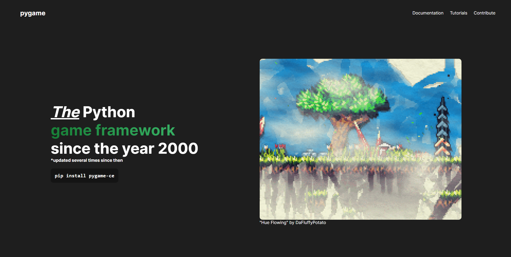

     

## About

The official website representing Pygame: Community Edition utilizing NextJS, ReactJS, and TypeScript. We are currently using GitHub Pages to deploy our website, which might change in the future if we decide to add a database to store user projects.

## Contributing

Pull requests from outside the core development team are welcome, check out the [good-first-issues](https://github.com/pygame-community/pyga.me/issues?q=is%3Aissue+is%3Aopen+label%3A%22good+first+issue+%F0%9F%94%B0%22) tag.
Before you create a pull request, please create an issue using our [issue tracker](https://github.com/pygame-community/pyga.me/issues) to avoid any work efforts being lost.

### Limitations to Outside Contributors

We welcome all outside contributors to help out on building our website, but there are some limitations if you are not a core member of the development team.

1. Your pull request must have a low impact
2. You cannot make a complete redesign of a website page
3. New design choices are decided by the core development team

### Instructions to Build

1. Install NodeJS
2. Run `npm install` to install all dependencies
3. Run `npm run dev` to create a local server to start contributing!
4. Open [http://localhost:3000](http://localhost:3000) to view your changes
5. Before pushing a commit, please run `npx prettier --write .`
